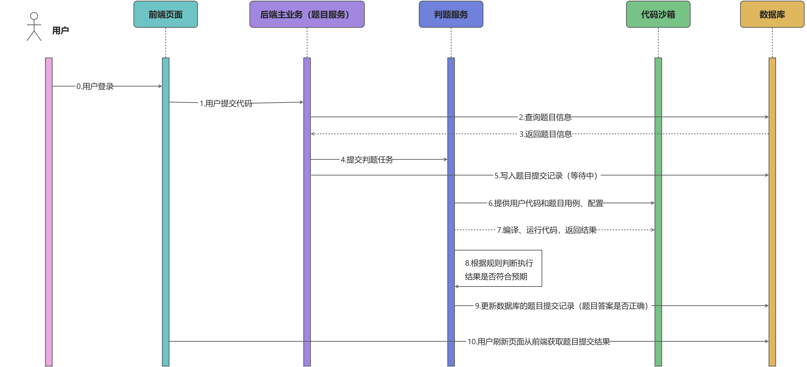

# TuanOJ
个人面试项目 TuanOj

本项目是一个在线判题（Online Judge）系统，基于 SSM + Springboot + Vue + Docker + Mysql 开发。用户可以在系统中浏览、搜索题目，提交代码，并在浏览题目提交页面看到自己的提交记录和结果。管理员可以在后台创建题目和修改题目。

以下是项目的一些亮点介绍：

- 在判题架构方面，本项目采用**判题机 + 代码沙箱**的形式，由判题机模块向代码沙箱提供用户输入，由代码沙箱执行用户输入后返回用户输出，再有判题机对用户输出进行判定。增强了系统的解耦，也便于后续的扩展。

- 在代码沙箱方面，使用 **Docker** 技术为每个用户代码创建单独的容器进行执行，从根本上消除了用户代码可能对系统的影响。同时创建**监控线程**对程序运行的时间和内存进行监控，当超时或内存溢出时强制停止并删除容器。

- 在用户代码方面，本项目采用**核心代码**模式（类似LeetCode），用户只需编写解决问题的核心算法部分。后台（代码沙箱模块）将根据用户编写的核心代码生成完整的可运行代码，进而编译和运行。

- 在多语言支持方面，本项目支持 **Java、Cpp、Python** 三种语言编写代码进行解题。使用**模板方法**创建统一的代码沙箱模板，再创建不同语言的代码沙箱类进行继承，通过重写方法实现不同语言**生成完整代码、编译以及运行**的不同。同时使用**策略模式**创建不同语言的判题逻辑（比如 Python 代码需要运行更多的时间、 Java 代码输出的数组格式的答案需要去掉元素之间的空格）。
- 在创建题目方面，管理员可以设置题目的时间和内存限制，并通过上传 **Json 文件**一键配置所有的判题用例。

**业务时序图**

